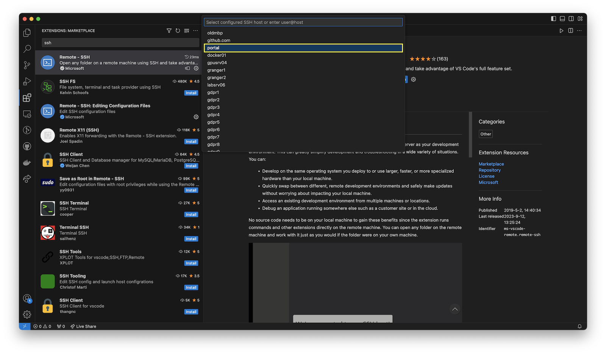
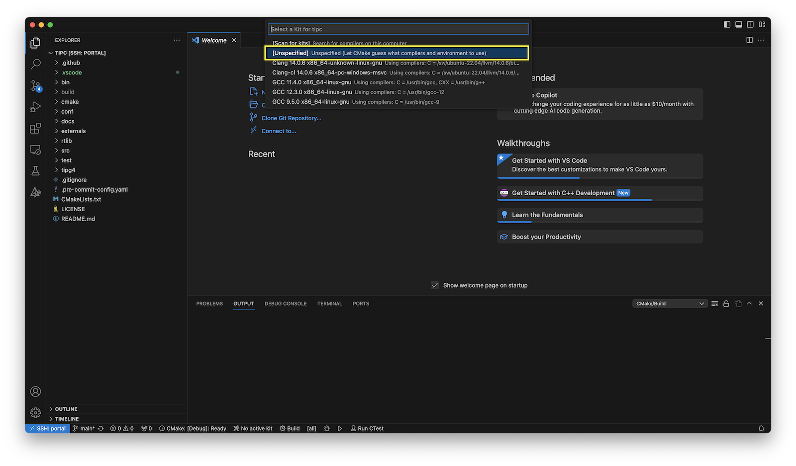
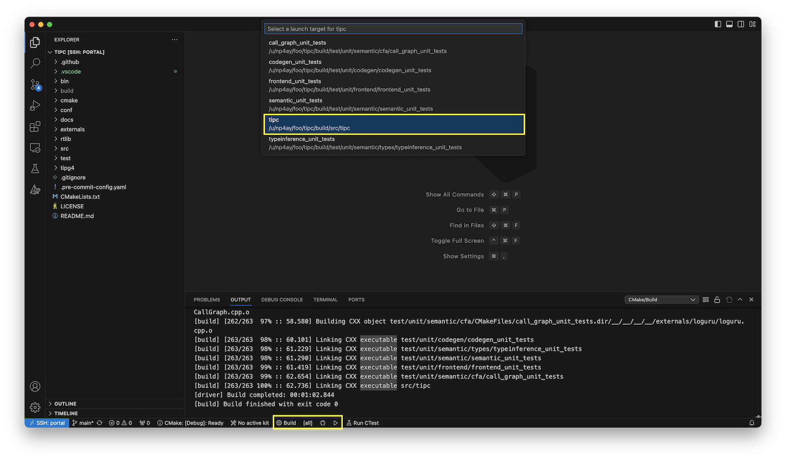
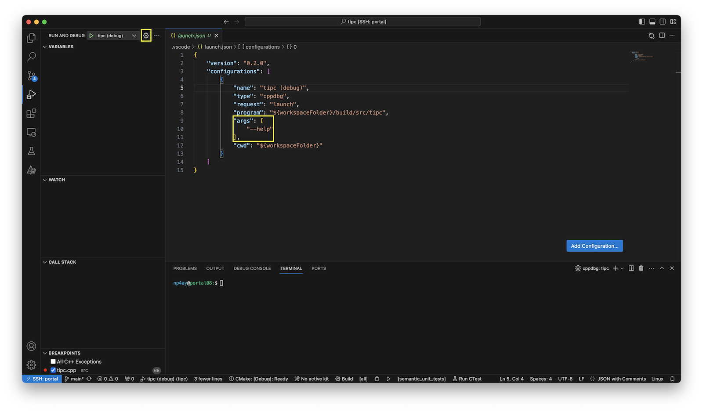

# Developing on UVA hardware (VS Code)
You can develop `tipc` on servers hosted by the CS department (e.g., portal,
granger). The file system shared by these machines includes all of the required
dependencies. For a familiar IDE experience, we can leverage VS Code and the
[Remote - SSH][6] extension. The following instructions describe how to install
and configure VS Code for `tipc` development on UVA hosted hardware.

## Configuring SSH
First, let us configure password-less logins to the server. In the following
instructions we will use the [portal cluster][1].  

We will use ssh keys instead of a username/password combination. Generate an
SSH key for portal connections.

```bash
cd ~/.ssh  # Create this directory if it does not exist.
ssh-keygen -t ed25519 -b 4096
```

When prompted, choose a filename for your keys and leave the passphrase field
empty.  

Next, copy the public key you just created to the remote server. 
```bash
ssh-copy-id -i ~/.ssh/<keyname> <computingID>@portal.cs.virginia.edu
```

When prompted, provide your UVA CS password.  

Once complete you should be able to ssh to the portal cluster without a password.  
```bash
ssh -i ~/.ssh/<keyname> <computingID>@portal.cs.virginia.edu
```

You can simplify the login experience with an [`ssh` config file][2]. In the
`~/.ssh` directory create a file named `config`, and add an entry that looks
like,
```
Host portal
  User <computingID>
  HostName portal.cs.virginia.edu
  IdentityFile ~/.ssh/uva/<keyname>
```

Now, you can login with `ssh portal`.

## Cloning tipc
From `portal`, clone `tipc`.

```bash
git clone https://github.com/matthewbdwyer/tipc.git
```

## Configuring the Remote environment.
You can configure your environment on `portal` by loading and unloading
[modules][3]. The `tipc` project includes [modulefiles][4] to help configure
the environment. The modulefiles are in the `conf` directory.  

You can load the tipc module with the following command.
```bash
module load ~/tipc/conf/modulefiles/tipc/F24
```

Please note that there is an assumption in the stock modulefile that `tipc` is
cloned to your home directory. If that assumption does not hold true, update
the `topdir` variable in `conf/modules/tipc/F24` to the actual location of the
`tipc` repository.  

To confirm the module was successfully loaded check the value of the `TIPCLANG`
environment variable.  
```bash
echo $TIPCLANG
# /sw/ubuntu-22.04/clangllvm/17.0.6/bin/clang
```

To load the `tipc` environment every time you ssh to portal, add the `module
load` command to your `bashrc`.
```bash
echo 'module load ~/tipc/conf/modulefiles/tipc/F24' >> ~/.bashrc
```

## Building tipc from the Command Line.
At this point you should be fully equipped to build tipc on portal from the command line.

From the `tipc` project directory,
```bash
mkdir build
cd build
cmake ..
make -j4
```

## Using VS Code and the "Remote - SSH" extension
You may prefer to develop with an IDE. In that case you can use [VS Code and the
Remote - SSH extension][6]. In this setup your local VS Code acts as a
lightweight client to a VS Code server running on the remote machine. You
connect the client to the server over SSH.  

First, [install VS Code][8] on your machine. Open the VS Code application.  

From the menu on the left, select the Extensions icon. Search for "ssh" and
install Microsoft's "Remote - SSH" extension.  


Once installed we can build a connection to portal. Open up the [Command
Palette][7] with `⇧⌘P` and search for "Connect to Host". Select the "Connect to
Host..." option.


You will see a list of remote hosts available to you. These hosts are populated
from your SSH config file. As such, you will see portal among the entries in
the list. Select portal.



This will open a new window and begin installing a VS Code server on the remote
machine. When complete we can open the `tipc` project we previously cloned.
When prompted, select "Yes, I trust the authors".  


The `tipc` project packages up [VS Code workspace settings][9] to minimize the
configurations you need to get started. Opening `tipc` for the first time will
install the required extensions and begin to configure your project.  You may
be prompted to specify a [CMake kit][10] for your project. We will select
"Unspecified" to let CMake perform its own automatic detection.



## Building tipc in VS Code
You should now be able to build `tipc`. From the bottom menu bar select the
"Build" button. The build process should complete with exit code 0.




## Running tipc in VS Code
There are several ways to run `tipc` from within VS Code. We describe one
below.  

Select the Run and Debug icon from the gutter on the left of VS Code. A "RUN AND
DEBUG" menu will appear. In that menu, select the green play button. This will
run `tipc` in debug mode.


You may wish to tweak this- or add another launch configuration. For instance,
if you wish to pass an argument to `tipc`. To do so, select the gear icon. This
will open `.vscode/launch.json`. Here you specify the arguments you wish to
provide. The [VS Code docs][11] provide more information on the configurations
available to you.



## Testing tipc in VS Code
The C++ TestMate extension adds support for Catch2 testing in VS Code. After you
build the project you can select the testing beaker icon. The `tipc` unit
tests are available to run under the "TestMate C++" section. 


Note, you can ignore the CTest section. 

[1]: https://www.cs.virginia.edu/wiki/doku.php?id=compute_portal
[2]: https://www.ssh.com/academy/ssh/config
[3]: https://www.cs.virginia.edu/wiki/doku.php?id=linux_environment_modules
[4]: https://modules.readthedocs.io/en/stable/modulefile.html
[5]: https://code.visualstudio.com/docs/remote/ssh
[6]: https://marketplace.visualstudio.com/items?itemName=ms-vscode-remote.remote-ssh
[7]: https://code.visualstudio.com/docs/getstarted/userinterface#_command-palette
[8]: https://code.visualstudio.com/download
[9]: https://code.visualstudio.com/docs/getstarted/settings
[10]: https://github.com/microsoft/vscode-cmake-tools/blob/main/docs/kits.md
[11]: https://code.visualstudio.com/docs/cpp/launch-json-reference#_args
